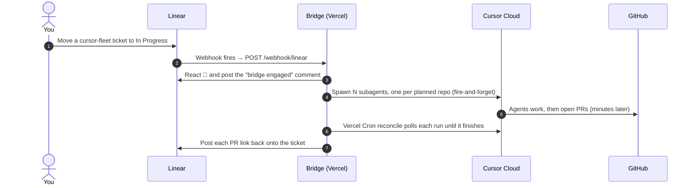
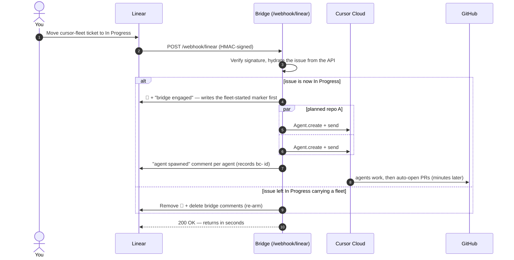

# Architecture

> How the Linear ↔ Cursor bridge turns **"drag a ticket to In Progress"** into a
> fleet of Cursor cloud agents that open pull requests — and reports each PR back
> onto the ticket, with **no database** and **no polling**.

This doc is meant to be read top-to-bottom in a demo: start with the big picture,
then walk the request flows, then (optionally) dig into the code map. Every
diagram renders natively on GitHub.

---

## At a glance



Read it top to bottom — that is the whole demo:

- **Steps 1–4 · spawn (fast).** Moving the ticket fires a signed Linear webhook.
  The bridge reacts 🚀, records a marker, and spawns the planned repo agents
  **fire-and-forget**. The HTTP call returns in **seconds** — it never waits on a
  multi-minute run.
- **Steps 5–7 · finish (out-of-band).** Minutes later the agents open PRs; a
  Vercel Cron reconcile sweep polls each run and posts the PR link back onto the
  ticket.

Linear comments are the only state store — there is **no database**. There is also
**no local poller**: the Linear webhook is the trigger, and a Vercel Cron drives
completion.

---

## The request flows

Two small, independent flows do all the work, plus two manual operator endpoints.
Each one is **idempotent**, so it is safe to retry, re-run, and run on a schedule.

### 1. Trigger — drag a ticket to *In Progress*

A signed Linear webhook fires on every issue update. The bridge gives an instant
visible signal, spawns the agents **fire-and-forget**, and returns — it never
waits on a multi-minute run. The same handler also **re-arms** a ticket when it
leaves *In Progress*, so the demo can be replayed.



The `par` block is the detail the overview leaves out: all planned repo agents
spawn **together**, and the `fleet-started` marker is written *before* any spawn
so a repeated delivery is deduped. Returns in **seconds** — the bridge never blocks.
Code: `handleWebhook()` in [`src/index.ts`](src/index.ts), `triggerFleet()` /
`shouldSpawn()` / `resetIssue()` in [`src/fleet.ts`](src/fleet.ts), `spawnAgent()`
/ `buildPrompt()` in [`src/agents.ts`](src/agents.ts), signature check in
[`src/security.ts`](src/security.ts).

### 2. Reconcile — an agent finishes

The slow path runs **out-of-band**, driven by a Vercel Cron. It finds agents that
finished but were never reported, reads each run's status from the Cursor SDK, and
posts the PR back.

```mermaid
sequenceDiagram
    autonumber
    participant Cron as Vercel Cron (daily; minute on Pro)
    participant Bridge as Bridge (/api/reconcile)
    participant Linear
    participant Cloud as Cursor Cloud

    Cron->>Bridge: GET /api/reconcile (Authorization: Bearer CRON_SECRET)
    Bridge->>Linear: List cursor-fleet issues + read comment markers
    loop each pending agent (spawned, no agent-done marker)
        Bridge->>Cloud: Agent.listRuns(agentId) → latest run
        alt run is terminal (finished / error / cancelled)
            Bridge->>Linear: Post "agent finished" + PR URL (writes agent-done marker)
        else still running
            Bridge-->>Bridge: skip — retry next tick
        end
    end
    Bridge->>Linear: When all agents are done, post "fleet complete"
```

Idempotent: the per-agent `agent-done` markers mean an agent is reported exactly
once, no matter how often the sweep runs.
Code: `reconcileAll()` in [`src/fleet.ts`](src/fleet.ts),
`checkAgentRun()` in [`src/agents.ts`](src/agents.ts).

> **Cron cadence.** `vercel.json` schedules `/api/reconcile` once daily
> (`0 9 * * *`) so it deploys on a **Hobby** plan. On **Vercel Pro**, bump the
> schedule to `* * * * *` for automatic minute-level reconcile. On Hobby, use the
> manual reconcile curl during a live demo to post PRs back immediately.

### Manual operator endpoints

Two secured endpoints exist as manual backups; neither is needed for the normal
webhook flow:

- `POST /api/trigger` — manually launch a fleet for an issue id (same code path as
  the webhook). Useful before the webhook is registered, or to re-fire a trigger.
- `POST /api/reset` — manually re-arm an issue (clears the bridge's comments +
  reaction). The webhook already does this when a ticket leaves *In Progress*.

Both authenticate with `BRIDGE_TRIGGER_SECRET`. `POST /api/reconcile` accepts the
same secret too, so you can force a completion sweep by hand.

---

## Why it's built this way

- **Webhook-driven, no poller.** A signed Linear webhook is the single trigger.
  The old `watch:linear` polling loop (which hit Linear ~2×/3s even when idle, and
  blew past Linear's per-key hourly rate limit) is gone.
- **Fire-and-forget spawn.** A cloud agent run takes many minutes — far longer
  than a serverless function can stay alive. So the trigger path spawns agents
  and returns immediately; it never calls `run.wait()`.
- **No database — Linear is the state store.** The comment thread itself records
  "fleet started", "agent done", and "fleet complete" via hidden markers. That
  makes the whole system idempotent across serverless cold starts with zero
  infrastructure.
- **Decoupled spawn vs. reconcile.** Spawning is fast and webhook-driven;
  completion is a separate sweep driven by a Vercel Cron, because agent
  completion is a Cursor event the Linear webhook can't observe.

---

## State store: Linear comment markers

The bridge keeps no state of its own. These hidden HTML-comment markers, defined
in [`src/config.ts`](src/config.ts), turn the Linear comment thread into a durable,
idempotent store.

| Marker | Posted | Purpose |
|---|---|---|
| `conductor` | on generic conductor comments | lets reset find and delete bridge comments |
| `conductor:fleet-started` | **before** spawning | dedupe — a fleet launches at most once per ticket |
| `conductor:agent-done id=bc-...` | when an agent's PR is reported | keeps reconcile from reporting the same agent twice |
| `conductor:fleet-complete` | when all agents have reported | posts the one-time "fleet complete" summary |
| `conductor:deployed` / `conductor:verified` | after Vercel deploy + health check | advances deploy/observe dashboard stages |
| `conductor:remediation-agent` / `conductor:remediation-done` | around Datadog-triggered hotfix work | tracks remediation separately from build agents |

---

## Code map

Everything the diagrams reference, mapped to the source.

| Concern | Where it lives |
|---|---|
| HTTP surface — every route | [`src/index.ts`](src/index.ts) |
| Webhook handler (trigger + reset-on-leave) | `handleWebhook()` in [`src/index.ts`](src/index.ts) |
| Decide to spawn / launch the fleet | `shouldSpawn()`, `triggerFleet()` in [`src/fleet.ts`](src/fleet.ts) |
| Spawn one cloud agent (fire-and-forget) | `spawnAgent()` in [`src/agents.ts`](src/agents.ts) |
| Planner prompt + task selection | [`src/planner.ts`](src/planner.ts) |
| Fleet-agent task prompt | `buildPrompt()` in [`src/agents.ts`](src/agents.ts) |
| Reconcile finished runs → PR URLs | `reconcileAll()` in [`src/fleet.ts`](src/fleet.ts), `checkAgentRun()` in [`src/agents.ts`](src/agents.ts) |
| Re-arm a ticket on leave | `resetIssue()` in [`src/fleet.ts`](src/fleet.ts), `deleteBridgeComments()` in [`src/linear.ts`](src/linear.ts) |
| Linear access + comment parsers | [`src/linear.ts`](src/linear.ts) |
| Trigger filters, model, markers, emoji | [`src/config.ts`](src/config.ts) |
| Webhook signature + bearer-secret auth | [`src/security.ts`](src/security.ts) |
| One-time workspace setup (label + ticket + webhook) | [`scripts/setup-new-workspace.mjs`](scripts/setup-new-workspace.mjs) |

---

## End-to-end demo walkthrough

What the customer sees, mapped to the flow that drives it:

1. **You drag a `cursor-fleet` ticket to In Progress.** *(Flow 1)*
2. **The Linear webhook fires**, and within ~1s the ticket reacts with 🚀 and a
   "Cursor bridge engaged" comment appears — the instant signal that the bridge
   caught the move.
3. **One "agent spawned" comment appears per planned repo**, each carrying a
   `bc-` agent id and repository name.
4. **As each agent finishes, its PR link is posted back** onto the ticket by the
   reconcile cron, then a final "fleet complete" comment. *(Flow 2)*
5. **Drag the ticket back out to replay** — the webhook re-arms the ticket (the
   bridge's comments are cleared), so dragging it back in launches a fresh run.

For setup, environment variables, and the full operator runbook, see the
[README](README.md).
