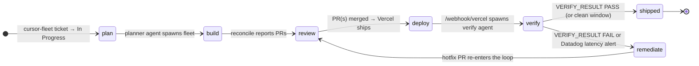
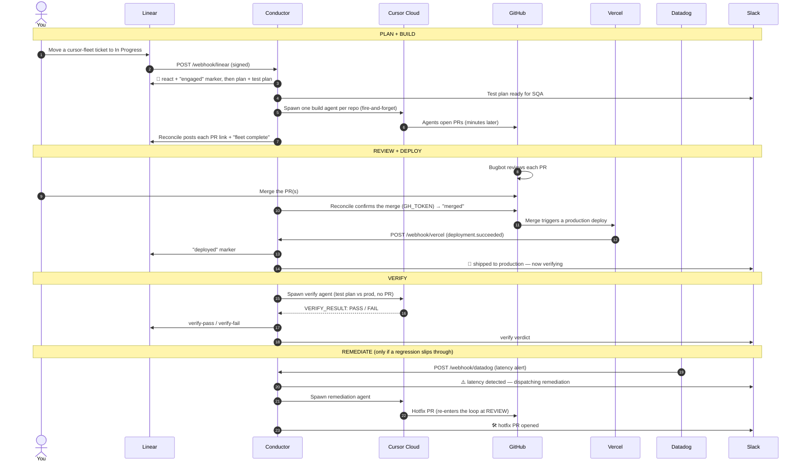
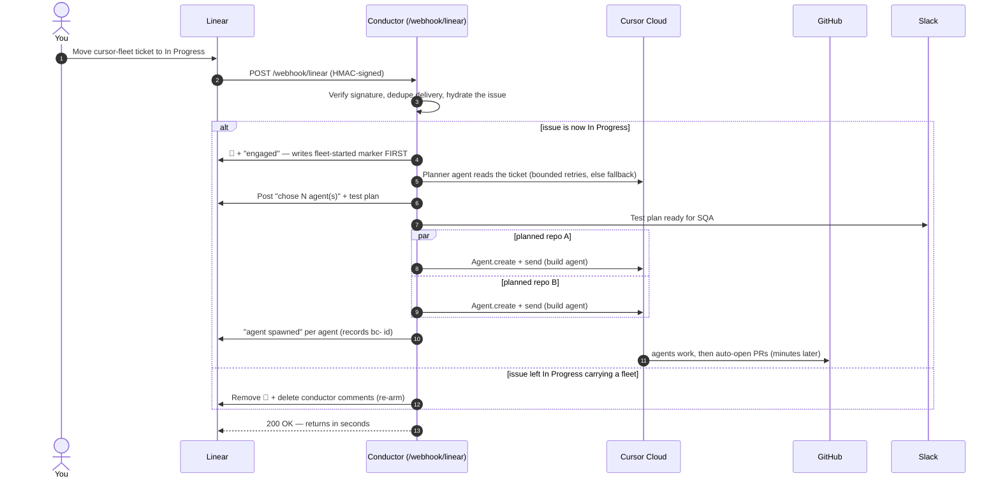
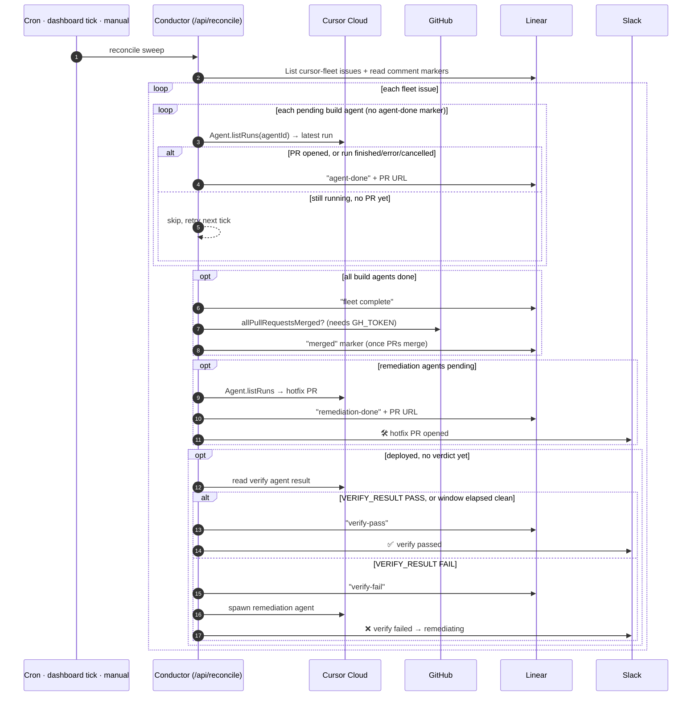
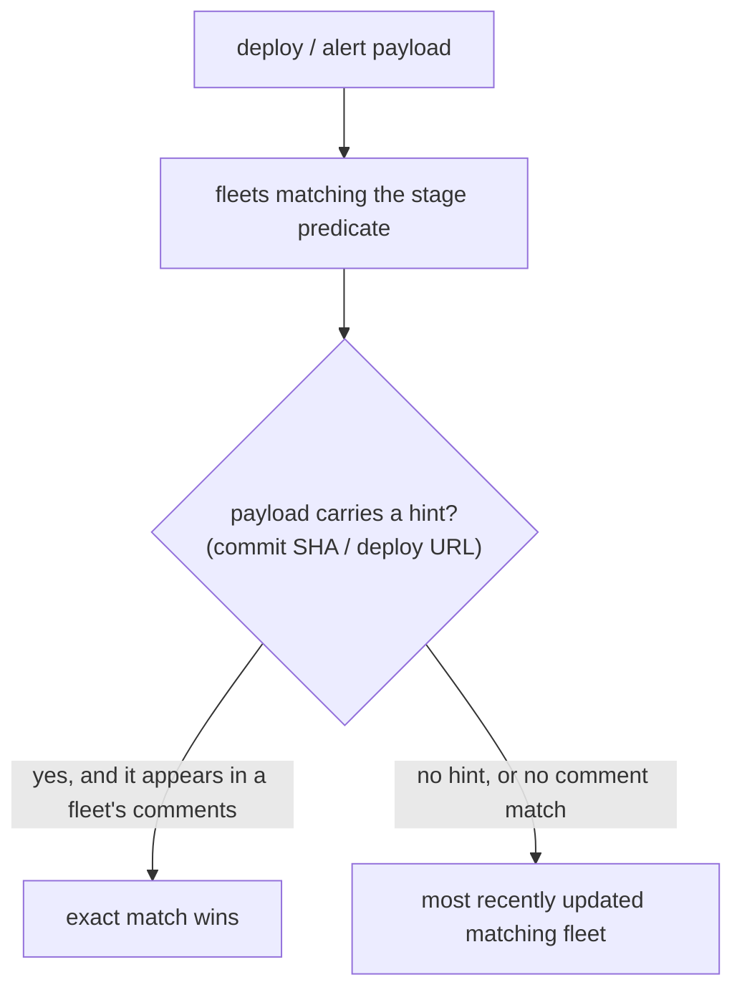

# Architecture

> How **conductor** turns **"drag a ticket to In Progress"** into a closed-loop
> software factory: a planner reads the ticket, a fleet of Cursor cloud agents
> opens PRs, review + merge ships them, a verify agent runs the test plan on
> production, and a Datadog alert can dispatch a self-remediating hotfix — all
> reported back through Linear, Slack, and a live dashboard, with **no database**.

This doc is meant to be read top-to-bottom in a demo: start with the closed-loop
mental model, walk the full run, then dig into each request flow and (optionally)
the code map. Every diagram renders natively on GitHub.

---

## At a glance — the closed loop

Conductor advances every ticket through six ordered stages. State lives entirely
in Linear comment markers; each stage transition is driven by a webhook, a cloud
agent, or the reconciler. Remediation is the only backward edge: a hotfix PR
re-enters the loop at **review**, closing the circle.



| Stage | What runs | Driven by |
|---|---|---|
| **plan** | Planner cloud agent classifies the ticket, emits one build task per repo, posts a test plan | `/webhook/linear` |
| **build** | One cloud agent per task opens a PR (fire-and-forget) | fleet spawn + reconcile |
| **review** | Bugbot reviews each PR; a human merges | GitHub + reconcile merge check |
| **deploy** | Vercel ships the merge to production | `/webhook/vercel` |
| **verify** | Verify cloud agent runs the test plan against prod | verify agent + reconcile |
| **remediate** | Remediation cloud agent opens a hotfix PR, which loops the pipeline back through review → deploy → verify until the hotfix ships and re-verifies | `/webhook/datadog` or verify fail |

Two properties make the whole thing robust: every entry point is **idempotent**
(safe to retry, replay, and run on a schedule), and spawning is always
**fire-and-forget** — no HTTP request ever blocks on a multi-minute cloud run.

---

## The full run, end to end

The same six stages as a single sequence. The webhook-driven steps return in
seconds; the multi-minute cloud runs (build, verify, remediation) always finish
out-of-band and are picked up by the reconciler.



Linear comments are the only state store — there is **no database**. There is no
dedicated poller either: the three webhooks trigger their stages, and completion
of the long-running cloud agents is swept up by the reconciler (a Vercel Cron
backstop, an opportunistic tick on dashboard polls, or a manual curl).

---

## The request flows

Three webhooks trigger stages and one reconciler advances the long-running work.
Each entry point is **idempotent** — safe to retry, replay, and run on a schedule.

### 1. Trigger + plan — drag a ticket to *In Progress*

A signed Linear webhook fires on every issue update. Conductor gives an instant
visible signal, runs a **planner cloud agent** to decide which repos need work and
emit a test plan, then spawns the build agents **fire-and-forget** and returns —
it never waits on a multi-minute run. The same handler also **re-arms** a ticket
when it leaves *In Progress*, so the demo can be replayed.



The `fleet-started` marker is written *before* the planner runs, so a repeated
webhook delivery is deduped. The planner is a real Cursor cloud agent (~50s) run
inside the webhook's `waitUntil`; a bounded retry (`PLANNER_MAX_ATTEMPTS`) rides
out a transient cloud-run hiccup before a deterministic fallback that still honors
any repos the ticket explicitly names. All planned agents spawn **together**.
Code: `handleWebhook()` in [`src/index.ts`](src/index.ts); `triggerFleet()` /
`shouldSpawn()` / `resetIssue()` in [`src/pipeline/fleet.ts`](src/pipeline/fleet.ts);
`planFleet()` in [`src/pipeline/planner.ts`](src/pipeline/planner.ts); `spawnAgent()` /
`buildPrompt()` in [`src/pipeline/agents.ts`](src/pipeline/agents.ts); signature check in
[`src/http/security.ts`](src/http/security.ts).

### 2. Reconcile — the engine that advances everything

The slow work (build, verify, and remediation cloud runs) finishes **out-of-band**.
The reconciler is the one sweep that picks it all up: it reports build PRs,
confirms merges, reports hotfix PRs, and closes the verify window. It is driven by
a Vercel Cron backstop, an opportunistic tick fired by dashboard polls, or a
manual curl.



Idempotent throughout: per-agent `agent-done` / `remediation-done` markers and the
one-shot `merged` / `verify-pass` markers mean each thing is reported exactly once,
no matter how often the sweep runs.
Code: `reconcileAll()` / `reconcileMerge()` / `reconcileVerify()` in
[`src/pipeline/fleet.ts`](src/pipeline/fleet.ts); `checkAgentRun()` /
`readAgentRunResult()` / `isRunReportable()` in [`src/pipeline/agents.ts`](src/pipeline/agents.ts).

> **Cron cadence.** `vercel.json` schedules `/api/reconcile` once daily
> (`0 9 * * *`) so it deploys on a **Hobby** plan. On **Vercel Pro**, bump the
> schedule to `* * * * *` for automatic minute-level reconcile. During a live demo
> on Hobby, the dashboard's own polling fires an opportunistic `reconcileTick()`
> (throttled by `RECONCILE_TICK_MS`), or use the manual reconcile curl.

### 3. Deploy + verify — a merge ships to production

Vercel posts `deployment.succeeded` for the target repo. Conductor attributes it to
the in-flight fleet, records the deploy, announces the ship to Slack, and spawns a
**verify cloud agent** that runs the ticket's test plan against the live site. The
verdict is closed later by the reconciler (Flow 2).

```mermaid
sequenceDiagram
    autonumber
    participant Vercel
    participant Conductor as Conductor (/webhook/vercel)
    participant GitHub
    participant Datadog
    participant Linear
    participant Cloud as Cursor Cloud
    participant Slack

    Vercel->>Conductor: deployment.succeeded (?secret=…)
    Conductor->>Conductor: parse deploy; keep only PRODUCTION of the target repo
    Conductor->>Linear: findActiveFleet (build done, not deployed) — SHA/URL hint
    opt GH_TOKEN set and merge not yet recorded
        Conductor->>GitHub: confirm build PR(s) merged
        Conductor->>Linear: "merged" marker, or ignore deploy if PRs still open
    end
    Conductor->>Linear: "deployed" marker
    Conductor->>Datadog: error-log scan (surface errors already in prod)
    Conductor->>Slack: 🚀 shipped to production — now verifying
    Conductor->>Cloud: spawn verify agent (test plan vs prod, no PR)
    Note over Cloud: runs each case, ends with VERIFY_RESULT: PASS / FAIL
```

The deploy is gated on a **real merge**: production redeploys for reasons unrelated
to any one ticket and its prod URL rotates, so with a `GH_TOKEN` conductor confirms
the fleet's PR(s) actually merged before advancing; without a token it trusts the
deploy as the merge signal. The error scan is deliberately conductor-side and
read-only (fast, deterministic) — the positive verify verdict comes from the
agent, not the scan.
Code: `handleVercelDeployment()` in [`src/pipeline/observability.ts`](src/pipeline/observability.ts);
`spawnVerifyAgent()` / `verifyPrompt()` in [`src/pipeline/agents.ts`](src/pipeline/agents.ts);
`findActiveFleet()` in [`src/pipeline/fleet.ts`](src/pipeline/fleet.ts);
`checkServiceHealth()` in [`src/integrations/datadog.ts`](src/integrations/datadog.ts).

### 4. Remediate — a production alert closes the loop

A Datadog monitor (or a failed verify verdict) attaches to the fleet in its
post-deploy verify window, announces the problem to Slack, and dispatches a
**remediation cloud agent** that opens a hotfix PR — which re-enters the loop at
review.

```mermaid
sequenceDiagram
    autonumber
    participant Datadog
    participant Conductor as Conductor (/webhook/datadog)
    participant Linear
    participant Cloud as Cursor Cloud
    participant GitHub
    participant Slack

    Datadog->>Conductor: monitor alert (?secret=…)
    Conductor->>Conductor: ignore recovery/empty; require a firing latency alert
    Conductor->>Linear: findActiveFleet (verify running, remediate pending)
    alt matched fleet, not already remediated
        Conductor->>Slack: ⚠️ latency detected — dispatching remediation
        Conductor->>Cloud: spawn remediation agent (diagnose slow path)
        Conductor->>Linear: "remediated" + remediation-agent markers
        Cloud->>GitHub: open hotfix PR (restore cache / batching)
        Note over GitHub: hotfix PR re-enters the loop at REVIEW
    else no active verify window, or already remediated
        Conductor-->>Datadog: 202 accepted, not dispatched
    end
```

Remediation only fires for a fleet **actively verifying** — happy-path tickets that
already passed verify never get an agent, and recovery/empty payloads are dropped
before the (paid) dispatch. The `remediated` marker plus an in-memory in-flight
guard dedupe repeat alerts. The hotfix PR's completion is reported by the
reconciler (Flow 2), and merging it flows back through review → deploy → verify.
Code: `handleDatadogAlert()` / `shouldDispatchToFleet()` in
[`src/pipeline/remediation.ts`](src/pipeline/remediation.ts); `spawnRemediationAgent()` /
`remediationPrompt()` in [`src/pipeline/agents.ts`](src/pipeline/agents.ts);
verify-fail path in `reconcileVerify()` in [`src/pipeline/fleet.ts`](src/pipeline/fleet.ts).

### Manual operator endpoints

Two secured endpoints exist as manual backups; neither is needed for the normal
webhook flow:

- `POST /api/trigger` — manually launch a fleet for an issue id (same code path as
  the webhook). Useful before the webhook is registered, or to re-fire a trigger.
- `POST /api/reset` — manually re-arm an issue (clears conductor's comments +
  reaction). The webhook already does this when a ticket leaves *In Progress*.

Both authenticate with `BRIDGE_TRIGGER_SECRET`. `POST /api/reconcile` accepts the
same secret too, so you can force a completion sweep by hand; the Vercel and
Datadog webhooks can likewise be replayed by curl (see [DEMO_FLOW.md](DEMO_FLOW.md) §5).

---

## Attribution: matching a deploy or alert to a fleet

Vercel and Datadog payloads carry **no Linear id**, so conductor has to guess which
fleet a deploy or alert belongs to. `findActiveFleet` filters candidates by stage
predicate, then disambiguates:



A Vercel deploy passes its commit SHA + URL as a hint, so an exact match wins when
one is recorded. Datadog alerts carry no hint and production deploys share one URL,
so the fallback is "most recently updated matching fleet." The practical
constraint: run only **one** `cursor-fleet` ticket through deploy/verify/remediate
at a time (see [DEMO_FLOW.md](DEMO_FLOW.md) §8).
Code: `selectActiveFleet()` / `findActiveFleet()` in [`src/pipeline/fleet.ts`](src/pipeline/fleet.ts).

---

## Why it's built this way

- **Webhook-driven, no poller.** Three signed webhooks (Linear, Vercel, Datadog)
  trigger their stages. The old `watch:linear` polling loop (which hit Linear
  ~2×/3s even when idle, and blew past Linear's per-key hourly rate limit) is gone.
- **Fire-and-forget spawn.** Every cloud agent — planner, build, verify,
  remediation — runs for many minutes, far longer than a serverless function can
  stay alive. So each spawn returns immediately; conductor never calls `run.wait()`
  and instead recovers each run later via `Agent.listRuns`.
- **No database — Linear is the state store.** The comment thread records every
  stage transition via hidden markers, so the whole system is idempotent across
  serverless cold starts with zero infrastructure. The dashboard and Slack are
  pure projections of those markers.
- **Decoupled trigger vs. reconcile.** Triggering a stage is fast and
  webhook-driven; completion of the long cloud runs is a separate sweep, because
  a run finishing is a Cursor event no inbound webhook can observe. One reconciler
  advances build, review/merge, verify, and remediation.
- **A conductor-side scan, agent-side verdict.** The deploy-time error scan is
  read-only and deterministic so the demo stays fast; the code-writing stages
  (build, verify, remediation) are real cloud agents. That keeps trust where it
  belongs — an agent, not a heuristic, decides pass/fail.
- **Backward edge only for remediation.** The pipeline is a straight line except
  for the one loop that matters: a hotfix PR re-enters at review, so a regression
  caught in production is fixed by the same machinery that shipped it.

---

## Stage ↔ marker model

Each stage's state is derived purely from the issue's comment markers (see
`deriveStages()` in [`src/pipeline/fleet.ts`](src/pipeline/fleet.ts)), which is
exactly what the dashboard reads from `GET /api/board`.

| Stage | Becomes `done` when… | Marker(s) | Driven by |
|---|---|---|---|
| **plan** | a fleet is planned + agents spawned (+ test plan posted) | `fleet-started`, `test-plan`, `agent spawned` | `/webhook/linear` → planner |
| **build** | every build agent run is terminal or has a PR | `agent-done id=…`, `fleet-complete` | reconcile reads cloud runs |
| **review** | the build PR(s) merged (or a deploy stands in) | `merged` (or `deployed`) | Bugbot + human merge, confirmed by reconcile |
| **deploy** | Vercel `deployment.succeeded` arrives | `deployed` | `/webhook/vercel` |
| **verify** | verify agent reports pass, or the window elapses clean | `verify-pass` (fails on `verify-fail`) | verify agent + reconcile |
| **remediate** | the hotfix merged, redeployed, and re-verified | `remediated` (running) → `remediation-done` (loops review/deploy/verify back) → `hotfix-verify-pass` (done) | `/webhook/datadog` or verify fail + reconcile + `/webhook/vercel` |

---

## State store: Linear comment markers

Conductor keeps no state of its own. These hidden HTML-comment markers, defined
in [`src/config.ts`](src/config.ts), turn the Linear comment thread into a durable,
idempotent store. Every conductor comment also carries the generic `conductor`
tag so `reset` can find and delete them all.

| Marker | Posted | Purpose |
|---|---|---|
| `conductor` | on **every** conductor comment | lets reset find and delete all conductor comments |
| `conductor:fleet-started` | **before** planning/spawning | dedupe so a fleet launches at most once per ticket |
| `conductor:test-plan` | during planning | posts the top 3–5 critical QA checks for SQA review |
| `conductor:agent-done id=bc-…` | when a build agent's PR is reported | keeps reconcile from reporting the same agent twice |
| `conductor:fleet-complete` | when all build agents have reported | posts the one-time "fleet complete" summary |
| `conductor:merged` | when every build PR has merged on GitHub | advances review/merge on the real merge |
| `conductor:deployed` | when a production deploy of the target repo succeeds | records the deploy; starts the verify window |
| `conductor:verify-agent id=bc-…` | when the verify agent is dispatched | tracks the verify run distinct from build agents |
| `conductor:verify-pass` / `conductor:verify-fail` | when the verify agent reports (or the window elapses) | closes verify with a verdict |
| `conductor:remediated` | when a Datadog alert or verify fail dispatches remediation | starts remediate; dedupes repeat alerts |
| `conductor:remediation-agent id=bc-…` / `conductor:remediation-done id=bc-…` | around alert-triggered hotfix work | tracks remediation separately from build agents; an opened hotfix PR loops review/deploy/verify back |
| `conductor:hotfix-merged` / `conductor:hotfix-deployed` | when the hotfix PR(s) merge / their production deploy lands | advance the looped-back review and deploy stages |
| `conductor:hotfix-verify-agent id=bc-…` | when the re-verify agent is dispatched against the hotfix deploy | tracks the hotfix cycle's verify run distinct from the initial pass |
| `conductor:hotfix-verify-pass` / `conductor:hotfix-verify-fail` | when the hotfix re-verify reports (or its window elapses) | only `hotfix-verify-pass` completes remediation |
| `conductor:announced` | when a stage result has been posted to Slack | marks Slack output as sent |

---

## Code map

Everything the diagrams reference, mapped to the source.

| Concern | Where it lives |
|---|---|
| HTTP surface — every route + all three webhooks | [`src/index.ts`](src/index.ts) |
| Linear webhook handler (trigger + reset-on-leave) | `handleWebhook()` in [`src/index.ts`](src/index.ts) |
| Decide to spawn / launch the fleet | `shouldSpawn()`, `triggerFleet()` in [`src/pipeline/fleet.ts`](src/pipeline/fleet.ts) |
| Planner agent (task list + test plan, retries, fallback) | `planFleet()` / `planWithRetries()` in [`src/pipeline/planner.ts`](src/pipeline/planner.ts) |
| Spawn one build agent (fire-and-forget) + prompt | `spawnAgent()` / `buildPrompt()` in [`src/pipeline/agents.ts`](src/pipeline/agents.ts) |
| Reconcile: report PRs, confirm merge, close verify | `reconcileAll()` / `reconcileMerge()` / `reconcileVerify()` in [`src/pipeline/fleet.ts`](src/pipeline/fleet.ts) |
| Read a cloud run's status / result | `checkAgentRun()` / `readAgentRunResult()` / `isRunReportable()` in [`src/pipeline/agents.ts`](src/pipeline/agents.ts) |
| Opportunistic reconcile from dashboard polls | `reconcileTick()` in [`src/pipeline/fleet.ts`](src/pipeline/fleet.ts), `/api/board` in [`src/index.ts`](src/index.ts) |
| Deploy handler (record deploy, gate on merge, spawn verify) | `handleVercelDeployment()` in [`src/pipeline/observability.ts`](src/pipeline/observability.ts) |
| Verify agent (test plan vs prod) + verdict parse | `spawnVerifyAgent()` / `parseVerifyVerdict()` in [`src/pipeline/agents.ts`](src/pipeline/agents.ts) |
| Deploy-time error scan (Datadog logs) | `checkServiceHealth()` in [`src/integrations/datadog.ts`](src/integrations/datadog.ts) |
| Remediation (Datadog alert → hotfix agent) | `handleDatadogAlert()` / `shouldDispatchToFleet()` in [`src/pipeline/remediation.ts`](src/pipeline/remediation.ts), `spawnRemediationAgent()` in [`src/pipeline/agents.ts`](src/pipeline/agents.ts) |
| Attribute a deploy/alert to a fleet | `findActiveFleet()` / `selectActiveFleet()` in [`src/pipeline/fleet.ts`](src/pipeline/fleet.ts) |
| Stage derivation + job/board summary | `deriveStages()` / `summarizeJob()` / `listJobs()` in [`src/pipeline/fleet.ts`](src/pipeline/fleet.ts) |
| Activity feed for the dashboard | `parseEvents()` in [`src/pipeline/events.ts`](src/pipeline/events.ts) |
| Slack output (test plan, deploy, verify, remediation) | `postSlack()` / `statusBlocks()` in [`src/integrations/slack.ts`](src/integrations/slack.ts) |
| PR merge-status check | `allPullRequestsMerged()` in [`src/integrations/github.ts`](src/integrations/github.ts) |
| Re-arm a ticket on leave | `resetIssue()` in [`src/pipeline/fleet.ts`](src/pipeline/fleet.ts), `deleteBridgeComments()` in [`src/integrations/linear.ts`](src/integrations/linear.ts) |
| Linear access + comment/marker parsers | [`src/integrations/linear.ts`](src/integrations/linear.ts) |
| Config: filters, models, markers, windows, emoji | [`src/config.ts`](src/config.ts) |
| Webhook signature + bearer/shared-secret auth | [`src/http/security.ts`](src/http/security.ts) |
| Mission-control dashboard HTML | [`src/http/dashboard.ts`](src/http/dashboard.ts) |
| One-time workspace setup (label + ticket + webhook) | [`scripts/setup-new-workspace.mjs`](scripts/setup-new-workspace.mjs) |

---

## End-to-end demo walkthrough

What the customer sees, mapped to the flow that drives it. Screen-share the
dashboard (`GET /`) so the waits for cloud agents become part of the show.

**Act 1 — happy path (a feature ships and verifies):**

1. **Drag a `cursor-fleet` ticket to In Progress.** Within ~1s the ticket reacts
   🚀 and a "Cursor bridge engaged — planning the fleet" comment appears. *(Flow 1)*
2. **The planner posts "chose N agent(s)" and a test plan**, then one "Cursor agent
   spawned" comment per planned repo, each carrying a `bc-` agent id. *(Flow 1)*
3. **Each build agent opens a PR; Bugbot reviews it.** The reconciler posts each PR
   link back, then a "fleet complete" comment. *(Flow 2)*
4. **Merge the PR(s).** Vercel deploys to production; conductor posts `deployed`,
   Slack shows "🚀 shipped to production — now verifying", and a verify agent runs
   the test plan against the live site. *(Flow 3)*
5. **Verify closes.** The reconciler posts `verify-pass` and Slack shows
   "✅ verify passed" once the agent reports (or the window elapses clean). *(Flow 2)*

**Act 2 — regression + self-remediation (the money shot):**

6. **A later ticket ships a change that passes review but is slow in production.**
   The Datadog synthetic catches the latency and fires `/webhook/datadog`. *(Flow 4)*
7. **Conductor dispatches remediation.** Slack shows "⚠️ latency detected —
   dispatching a remediation agent"; the agent opens a hotfix PR restoring
   caching/batching, which re-enters the loop at review. *(Flow 4 → Flow 2)*

**Replay:** drag the ticket back out of In Progress — the webhook re-arms it (all
conductor comments cleared), so dragging it back in launches a fresh run.

For setup, environment variables, secrets, and the full operator runbook, see the
[README](README.md); for the agent-checkable demo script, see [DEMO_FLOW.md](DEMO_FLOW.md).
