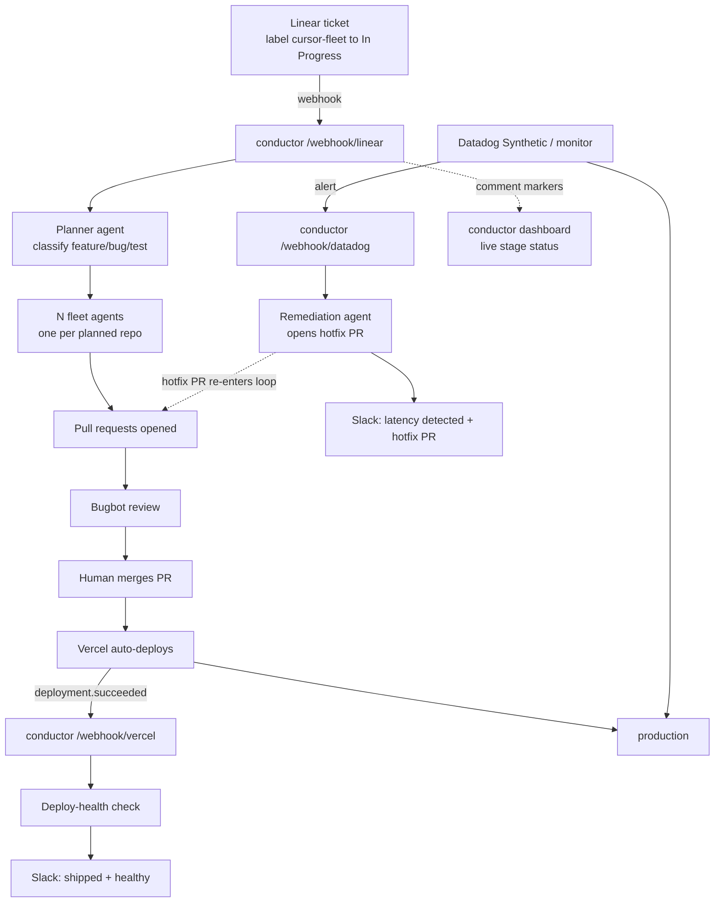

# conductor

Linear **webhook-first** bridge that turns a `cursor-fleet` ticket moving to
**In Progress** into a fleet of Cursor cloud agents, then reports PRs and later
pipeline stages back through Linear comments, Slack, and a read-only dashboard.

There is no database. The Linear comment thread is the state store. The Linear
webhook is the only automatic trigger; agent completion is reconciled out of band
by Vercel Cron because cloud-agent runs outlive the webhook request.

## Architecture

A visual, request-by-request walkthrough lives in **[ARCHITECTURE.md](ARCHITECTURE.md)**.
At a high level:



## The loop

1. **Trigger + reset** (`/webhook/linear`): a signature-verified Linear webhook.
   On a `cursor-fleet` issue moving to **In Progress**, the bridge reacts, posts
   a "Cursor bridge engaged" comment carrying the hidden `fleet-started` marker,
   asks a planner agent which repos need work, and spawns one cloud agent per
   planned task **fire-and-forget** (`Agent.create` + `agent.send`, no `run.wait`).
   When the same issue later **leaves** In Progress, the same handler re-arms it
   by removing the reaction and deleting conductor comments.
2. **Reconcile** (`/api/reconcile`): runs out-of-band on a Vercel Cron. It finds
   launched fleets from Linear comments, recovers each agent's run via
   `Agent.listRuns`, and posts completion comments with PR URLs once runs are
   terminal. Idempotent per-agent `agent-done` markers prevent duplicate reports.
3. **Deploy + observe** (`/webhook/vercel`): a successful production deployment
   of the target repo marks the matching fleet deployed, runs a deploy-health
   check, and announces the result to Slack.
4. **Remediate** (`/webhook/datadog`): a Datadog alert attaches to the active
   deployed fleet, announces the problem to Slack, and dispatches a remediation
   cloud agent that opens a hotfix PR.

Two **manual operator endpoints** exist as backups for the normal webhook flow:
`POST /api/trigger` launches a fleet for an issue id, and `POST /api/reset`
re-arms an issue by hand. Both use `BRIDGE_TRIGGER_SECRET`.

> **Cron cadence.** `vercel.json` runs `/api/reconcile` once daily
> (`0 9 * * *`) so it deploys on a **Hobby** plan. On **Vercel Pro**, bump the
> schedule to `* * * * *` for automatic minute-level reconcile. On Hobby, use the
> manual reconcile curl during a live demo to post PRs back immediately.

## Pipeline stages

Conductor advances each ticket through a state machine whose state lives entirely
in Linear comment markers:

| Stage | Trigger | What runs |
|---|---|---|
| Plan | `cursor-fleet` ticket to In Progress (`/webhook/linear`) | Planner agent classifies the ticket and emits one task per repo |
| Build | after planning | One fleet cloud agent per task opens a PR |
| Review | PR opened | Bugbot reviews the PR |
| Merge | human merges the PR | Conductor confirms the merge via the GitHub API (the reconciler writes a `merged` marker) |
| Deploy | Vercel `deployment.succeeded` (`/webhook/vercel`) | Conductor records deploy and checks health |
| Observe | deploy-health check + Datadog monitors | Slack announcement and ongoing production signal |
| Remediate | Datadog monitor alert (`/webhook/datadog`) | Remediation agent diagnoses and opens a hotfix PR |

## HTTP surface

| Route | Purpose |
|---|---|
| `GET /` | Mission-control dashboard (live per-ticket stage status) |
| `GET /api/health` | Liveness probe |
| `GET /api/board` | Public read-only dashboard data, reconstructed from Linear comments |
| `POST /api/trigger` | Secured manual fallback for the Linear webhook |
| `POST /api/reset` | Secured re-arm (clears conductor comments + reaction) |
| `GET\|POST /api/reconcile` | Cron-driven and manual completion sweep |
| `POST /webhook/linear` | Linear webhook (HMAC verified) |
| `POST /webhook/vercel` | Vercel deployment webhook (shared-secret) |
| `POST /webhook/datadog` | Datadog monitor webhook (shared-secret) |

Spawning is fast; completion is handled out of band by the reconciler so no
request blocks on a multi-minute agent run.

## Requirements

- Node 20+
- [pnpm](https://pnpm.io/)
- Cursor API key ([Dashboard -> Integrations](https://cursor.com/dashboard/integrations))
- Linear API key ([Settings -> API](https://linear.app/settings/api)) with access to the target workspace
- GitHub owner containing the target repos

## Environment variables

| Variable | Purpose |
|---|---|
| `CURSOR_API_KEY` | Cursor SDK auth (planner, fleet, and remediation agents; reconcile reads run status) |
| `LINEAR_API_KEY` | Post comments/reactions back to Linear (must match the workspace that owns the webhook) |
| `LINEAR_WEBHOOK_SECRET` | Verify Linear webhook signatures |
| `BRIDGE_TRIGGER_SECRET` | Secure `/api/trigger`, `/api/reset`, and manual `/api/reconcile` |
| `CRON_SECRET` | Authorize the Vercel Cron call to `/api/reconcile` |
| `VERCEL_WEBHOOK_SECRET` | Verify `/webhook/vercel` calls |
| `DATADOG_WEBHOOK_SECRET` | Verify `/webhook/datadog` calls |
| `DD_API_KEY` | Datadog API key for conductor's deploy-health query (optional) |
| `DD_APP_KEY` | Datadog application key for the health query (optional) |
| `DD_SITE` | Datadog site, e.g. `datadoghq.com` (default) |
| `SLACK_WEBHOOK_URL` | Slack incoming webhook for deploy/remediation output |
| `GH_OWNER` | GitHub org/user (default: `hsaab`) |
| `GH_TOKEN` | Optional. Reads PR merge status so review/merge advance on the real merge (needed for private target repos). Without it, a successful deploy is treated as proof of merge. Repo-scoped; named `GH_TOKEN` to avoid clobbering local `gh`/git auth. |
| `DEPLOY_TARGET_REPO` | Repo the loop builds/observes (default: `compound`) |
| `OBSERVE_WINDOW_MS` | Post-deploy monitoring window before observe closes cleanly (default: `120000`, 2 min) |
| `BRIDGE_MODEL_ID` | Cloud model for spawned agents (default: `composer-2.5`) |
| `PLANNER_MODEL_ID` | Model the planner agent uses (default: `composer-2.5`) |
| `MAX_AGENTS` | Upper bound on agents per ticket (default: `6`) |
| `BOARD_CACHE_MS` | TTL for the cached `/api/board` snapshot, so the dashboard's frequent polling collapses into at most one Linear read per window (default: `3000`, 3s) |
| `BRIDGE_URL` | Deployed conductor base URL (for manual curls) |

Set these on Vercel for production. For local curls keep them in `.env`:

```bash
set -a && source .env && set +a
```

## One-time workspace setup

`scripts/setup-new-workspace.mjs` idempotently provisions a Linear workspace for
the bridge: it creates the `cursor-fleet` label, the demo "Add X-Request-ID
middleware" ticket, and the Issue webhook signed with `LINEAR_WEBHOOK_SECRET`.

```bash
# .env must contain LINEAR_API_KEY (target workspace) + LINEAR_WEBHOOK_SECRET
pnpm setup
# optional overrides:
#   WEBHOOK_URL   (default https://cursor-demo-bridge.vercel.app/webhook/linear)
#   LINEAR_TEAM   (default FE-Cursor)
```

To register the Linear webhook by hand instead, open
[Linear -> Settings -> API -> Webhooks](https://linear.app/settings/api), create a
**New webhook** with URL `https://<your-host>/webhook/linear`, resource type
**Issues**, and copy the signing secret into `LINEAR_WEBHOOK_SECRET`.

## Register service webhooks

- Linear: Settings -> API -> Webhooks ->
  `https://<conductor-domain>/webhook/linear`, resource type Issues. Copy the
  signing secret to `LINEAR_WEBHOOK_SECRET`.
- Vercel: project webhook for `deployment.succeeded` ->
  `https://<conductor-domain>/webhook/vercel?secret=$VERCEL_WEBHOOK_SECRET`.
- Datadog: monitor notification webhook ->
  `https://<conductor-domain>/webhook/datadog?secret=$DATADOG_WEBHOOK_SECRET`.

## Demo flow

1. Open the dashboard at `GET /` and screen-share it.
2. Move a `cursor-fleet` Linear ticket from Backlog to **In Progress**.
3. The Linear webhook fires; within seconds the ticket reacts and a "Cursor bridge
   engaged" comment appears, followed by one "agent spawned" comment per planned
   repo with its `bc-` agent ID.
4. As each agent finishes, the reconcile cron posts a completion comment with the
   PR URL, then a final `fleet-complete` comment.
5. After review and merge, Vercel deploys; `/webhook/vercel` records deploy/health
   and posts to Slack.
6. If Datadog alerts, `/webhook/datadog` dispatches a remediation agent whose
   hotfix PR re-enters the loop.
7. Drag the ticket back out of **In Progress** to re-arm it; drag it back in for a
   fresh run.

## Secured endpoints (manual backups)

Keep `BRIDGE_URL` and `BRIDGE_TRIGGER_SECRET` in `.env` and load them once so the
secret never lands in shell history:

```bash
set -a && source .env && set +a
```

Manual trigger:

```bash
curl -X POST "$BRIDGE_URL/api/trigger" \
  -H "content-type: application/json" \
  -H "authorization: Bearer $BRIDGE_TRIGGER_SECRET" \
  -d '{"issueId":"FE-5","source":"manual-demo"}'
```

Manual reconcile (force any pending PR URLs back to Linear):

```bash
curl -X POST "$BRIDGE_URL/api/reconcile" \
  -H "authorization: Bearer $BRIDGE_TRIGGER_SECRET"
```

Manual reset (re-arm an issue by removing the reaction and deleting conductor comments):

```bash
curl -X POST "$BRIDGE_URL/api/reset" \
  -H "content-type: application/json" \
  -H "authorization: Bearer $BRIDGE_TRIGGER_SECRET" \
  -d '{"issueId":"FE-5"}'
```

## Local development

```bash
pnpm install
set -a && source .env && set +a
pnpm dev
```

Health check: `curl http://localhost:3001/api/health`

For local Linear webhook testing, run `ngrok http 3001`, then point the Linear
webhook URL at the HTTPS ngrok URL plus `/webhook/linear`.

## Deploy to Vercel

```bash
vercel link
vercel env add CURSOR_API_KEY
vercel env add LINEAR_API_KEY
vercel env add LINEAR_WEBHOOK_SECRET
vercel env add BRIDGE_TRIGGER_SECRET
vercel env add CRON_SECRET
vercel env add GH_OWNER
vercel deploy --prod
```

Make sure the Linear webhook URL points at your production domain, and that
`LINEAR_API_KEY` / `LINEAR_WEBHOOK_SECRET` belong to the **same** workspace that
owns the webhook.
