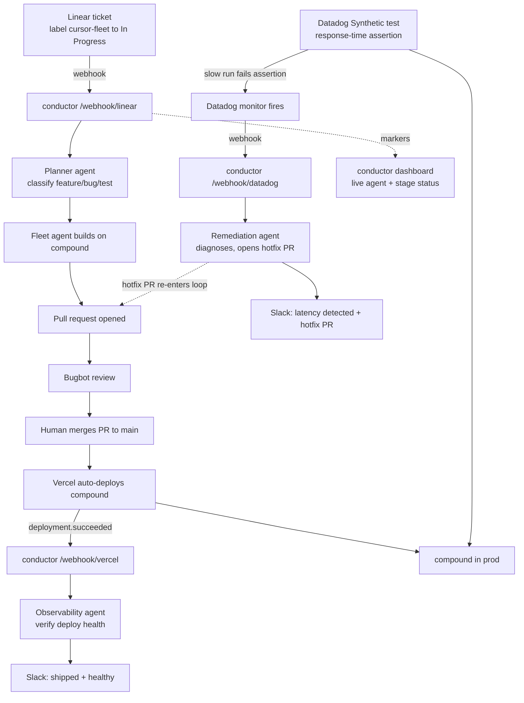

# conductor

A closed-loop software factory built on Cursor cloud agents. A Linear ticket goes in; a reviewed, deployed, observed, and (if needed) self-remediated change comes out, with status streamed to a live dashboard and Slack.

Conductor is the orchestration spine. The agents do the work: a planner reads the ticket and decides the fleet, fleet agents build and open PRs, an observability agent verifies each deploy, and a remediation agent opens a hotfix PR when production regresses. There is no database. The Linear comment thread is the state store.

## The loop



## Pipeline stages

Conductor advances each ticket through a state machine whose state lives entirely in Linear comment markers:

| Stage | Trigger | What runs |
|---|---|---|
| Plan | `cursor-fleet` ticket to In Progress (`/webhook/linear`) | Planner agent classifies the ticket (feature/bug/test) and emits one task per repo |
| Build | after planning | One fleet cloud agent per task opens a PR |
| Review | PR opened | Bugbot reviews the PR |
| Merge | human merges to main | Vercel auto-deploys |
| Deploy | Vercel `deployment.succeeded` (`/webhook/vercel`) | Observability agent verifies health via Datadog, posts to Slack |
| Observe | Datadog Synthetic + monitors | Watches latency and errors on `service:compound` |
| Remediate | Datadog monitor alert (`/webhook/datadog`) | Remediation agent diagnoses, posts findings to Slack, opens a hotfix PR |

## HTTP surface

| Route | Purpose |
|---|---|
| `GET /` | Mission-control dashboard (live per-ticket stage status) |
| `GET /api/health` | Liveness probe |
| `GET /api/jobs` | Read-only fleet status, reconstructed from Linear comments (`?all=1` includes complete) |
| `GET /api/jobs/:id` | Single fleet by Linear identifier |
| `POST /api/trigger` | Secured manual fallback for the Linear webhook |
| `POST /api/reset` | Secured re-arm (clears conductor comments + reaction) |
| `GET\|POST /api/reconcile` | Cron-driven and manual completion sweep |
| `POST /webhook/linear` | Linear webhook (HMAC verified) |
| `POST /webhook/vercel` | Vercel deployment webhook (shared-secret) -> observability agent |
| `POST /webhook/datadog` | Datadog monitor webhook (shared-secret) -> remediation agent |

Spawning is fast; completion is handled out of band by the reconciler so no request blocks on a multi-minute agent run.

## Environment variables

| Variable | Purpose |
|---|---|
| `CURSOR_API_KEY` | Cursor SDK auth (planner, fleet, observability, remediation agents) |
| `LINEAR_API_KEY` | Post comments back to Linear |
| `LINEAR_WEBHOOK_SECRET` | Verify Linear webhook signatures |
| `BRIDGE_TRIGGER_SECRET` | Secure `/api/trigger`, `/api/jobs`, `/api/reset`, manual `/api/reconcile` |
| `CRON_SECRET` | Authorize the Vercel Cron call to `/api/reconcile` |
| `VERCEL_WEBHOOK_SECRET` | Verify `/webhook/vercel` calls |
| `DATADOG_WEBHOOK_SECRET` | Verify `/webhook/datadog` calls |
| `DD_API_KEY` | Datadog API key for conductor's deploy-health query (optional) |
| `DD_APP_KEY` | Datadog application key for the health query (optional) |
| `DD_SITE` | Datadog site, e.g. `datadoghq.com` (default) |
| `SLACK_WEBHOOK_URL` | Slack incoming webhook for agent output (output only) |
| `GH_OWNER` | GitHub org/user (default: `hsaab`) |
| `DEPLOY_TARGET_REPO` | Repo the loop builds/observes (default: `compound`) |
| `BRIDGE_MODEL_ID` | Cloud model for spawned agents (default: `composer-2.5`) |
| `PLANNER_MODEL_ID` | Model the planner agent uses (default: `composer-2.5`) |
| `MAX_AGENTS` | Upper bound on agents per ticket (default: `6`) |
| `BRIDGE_URL` | Deployed conductor base URL (for manual curls) |

Set these on Vercel for production. For local curls keep them in `.env`:

```bash
set -a && source .env && set +a
```

## Demo runbook

1. Open the dashboard at `GET /` and screen-share it.
2. Drag a `cursor-fleet` Linear ticket to In Progress. Watch Plan and Build light up.
3. Bugbot reviews the PR. Merge it.
4. Vercel deploys; the observability agent posts "shipped + healthy" to Slack.
5. The Act 2 regression ticket ships a slow path; the Datadog Synthetic assertion fails and fires the monitor.
6. The remediation agent posts a diagnosis to Slack and opens a hotfix PR, which re-enters the loop.

See the plan for the full timed choreography and two-track de-risking (pre-warmed agent runs, pre-staged fallback branches, manual `/api/trigger` and `/api/reconcile` backups).

## Register the webhooks

- Linear: Settings -> API -> Webhooks -> `https://<conductor-domain>/webhook/linear`, resource type Issues. Copy the signing secret to `LINEAR_WEBHOOK_SECRET`.
- Vercel: project webhook for `deployment.succeeded` -> `https://<conductor-domain>/webhook/vercel?secret=$VERCEL_WEBHOOK_SECRET`.
- Datadog: monitor notification webhook -> `https://<conductor-domain>/webhook/datadog?secret=$DATADOG_WEBHOOK_SECRET`.

## Local development

```bash
pnpm install
set -a && source .env && set +a
pnpm dev
# In another terminal: ngrok http 3001, then point the Linear webhook at the ngrok host
```

Health check: `curl http://localhost:3001/api/health`
