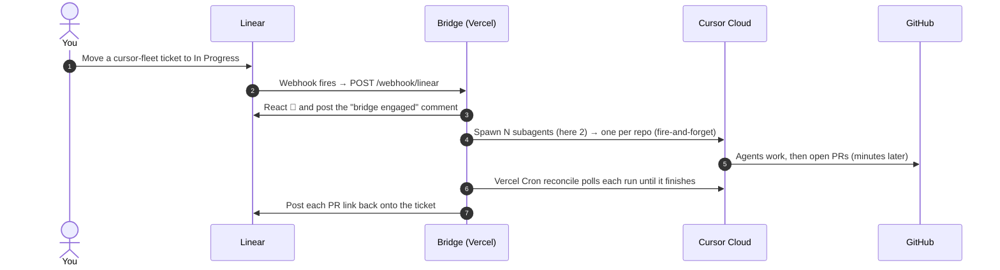

# cursor-demo-bridge

Linear **webhook** bridge that spawns Cursor cloud agents when a `cursor-fleet`
ticket moves to **In Progress** — then reports each agent's PR back onto the
ticket. No database, no polling.

It fans out to as many cloud subagents as you want, each working an independent
repo. This demo spawns **two** (one per repo) to keep the walkthrough simple, but
the count is arbitrary.

## Architecture

A visual, request-by-request walkthrough lives in **[ARCHITECTURE.md](ARCHITECTURE.md)** —
the best thing to show when explaining the demo end to end (drag a ticket →
agents spawn → PRs come back → re-arm).



**Steps 1–4** are the fast spawn path (the webhook handler returns in seconds);
**steps 5–7** are the out-of-band finish, where the agents open PRs and a Vercel
Cron reconcile sweep posts each PR link back onto the ticket. Linear comments are
the only state store — there is no database. See **[ARCHITECTURE.md](ARCHITECTURE.md)**
for the request flows in detail, the comment-marker state store, and a code map.

## How it works

Spawning and completion are decoupled, because a cloud agent run takes many
minutes — far longer than a serverless function can stay alive.

1. **Trigger + reset** (`/webhook/linear`): a signature-verified Linear webhook.
   On a `cursor-fleet` issue moving to **In Progress**, the bridge reacts 🚀, posts
   a "Cursor bridge engaged" comment carrying the hidden `fleet-started` marker,
   and spawns both agents **fire-and-forget** (`Agent.create` + `agent.send`, no
   `run.wait`). When the same issue later **leaves** In Progress, the same handler
   re-arms it (removes the reaction and deletes the bridge's comments) so the demo
   can be replayed. Returns in seconds.
2. **Reconcile** (`/api/reconcile`): runs out-of-band on a Vercel Cron. Finds
   issues with a `fleet-started` marker but no `fleet-complete` marker, recovers
   each agent's run via `Agent.listRuns`, and — once a run is terminal — posts a
   completion comment with the PR URL. Idempotent via per-agent `agent-done`
   markers; uses Linear comments as its only state store (no database).

Two **manual operator endpoints** exist as backups (neither is needed for the
normal webhook flow): `POST /api/trigger` launches a fleet for an issue id, and
`POST /api/reset` re-arms an issue by hand. Both use `BRIDGE_TRIGGER_SECRET`.

> **Cron cadence.** `vercel.json` runs `/api/reconcile` once daily
> (`0 9 * * *`) so it deploys on a **Hobby** plan. On **Vercel Pro**, bump the
> schedule to `* * * * *` for automatic minute-level reconcile. On Hobby, use the
> manual reconcile curl (below) during a live demo to post PRs back immediately.

## Prerequisites

- Node 20+
- [pnpm](https://pnpm.io/)
- Cursor API key ([Dashboard → Integrations](https://cursor.com/dashboard/integrations))
- Linear API key ([Settings → API](https://linear.app/settings/api)) with access to the target workspace
- GitHub owner with `compound` and `server` repos

## Environment variables

| Variable | Purpose |
|---|---|
| `CURSOR_API_KEY` | Cursor SDK auth (spawn agents, read run status) |
| `LINEAR_API_KEY` | Post comments/reactions back to Linear (must match the workspace that owns the webhook) |
| `LINEAR_WEBHOOK_SECRET` | Verify Linear webhook signatures |
| `BRIDGE_TRIGGER_SECRET` | Secure the manual `/api/trigger` and `/api/reset` endpoints |
| `CRON_SECRET` | Authorize the Vercel Cron call to `/api/reconcile` |
| `GH_OWNER` | GitHub org/user (default: `hsaab`) |
| `BRIDGE_MODEL_ID` | Optional cloud model override (default: `composer-2.5`) |

## Local development

```bash
pnpm install
export CURSOR_API_KEY=...
export LINEAR_API_KEY=...
export LINEAR_WEBHOOK_SECRET=...
export BRIDGE_TRIGGER_SECRET=...
export GH_OWNER=hsaab
pnpm dev
```

Health check: `curl http://localhost:3001/api/health`

## One-time workspace setup

`scripts/setup-new-workspace.mjs` idempotently provisions a Linear workspace for
the bridge: it creates the `cursor-fleet` label, the demo "Add X-Request-ID
middleware" ticket, and the Issue webhook (signed with `LINEAR_WEBHOOK_SECRET`).

```bash
# .env must contain LINEAR_API_KEY (target workspace) + LINEAR_WEBHOOK_SECRET
pnpm setup
# optional overrides:
#   WEBHOOK_URL   (default https://cursor-demo-bridge.vercel.app/webhook/linear)
#   LINEAR_TEAM   (default FE-Cursor)
```

To register the webhook by hand instead, open
[Linear → Settings → API → Webhooks](https://linear.app/settings/api), create a
**New webhook** with URL `https://<your-host>/webhook/linear`, resource type
**Issues**, and copy the signing secret into `LINEAR_WEBHOOK_SECRET`.

## Demo flow

1. Open the `cursor-fleet`-labeled "Add X-Request-ID middleware" ticket.
2. Move it from Backlog → **In Progress**.
3. The webhook fires; within ~1s the ticket reacts 🚀 and a "Cursor bridge
   engaged" comment appears, followed by one "agent spawned" comment per subagent
   with its `bc-` agent ID. This demo fans out to two subagents, one per repo:
   - `{GH_OWNER}/compound`
   - `{GH_OWNER}/server`
4. As each agent finishes, the reconcile cron posts a completion comment with the
   PR URL, then a final `fleet-complete` comment.
5. Drag the ticket back out of **In Progress** to re-arm it; drag it back in for a
   fresh run.

## Secured endpoints (manual backups)

Keep `BRIDGE_URL` and `BRIDGE_TRIGGER_SECRET` in `.env` and load them once so the
secret never lands in shell history:

```bash
set -a && source .env && set +a
```

Manual trigger:

```bash
curl -X POST "$BRIDGE_URL/api/trigger" \
  -H "content-type: application/json" \
  -H "authorization: Bearer $BRIDGE_TRIGGER_SECRET" \
  -d '{"issueId":"FE-5","source":"manual-demo"}'
```

Manual reconcile (force any pending PR URLs back to Linear):

```bash
curl -X POST "$BRIDGE_URL/api/reconcile" \
  -H "authorization: Bearer $BRIDGE_TRIGGER_SECRET"
```

Manual reset (re-arm an issue by removing the reaction and deleting the bridge's comments):

```bash
curl -X POST "$BRIDGE_URL/api/reset" \
  -H "content-type: application/json" \
  -H "authorization: Bearer $BRIDGE_TRIGGER_SECRET" \
  -d '{"issueId":"FE-5"}'
```

## ngrok (local webhook testing)

```bash
pnpm dev
ngrok http 3001
```

Point the Linear webhook URL at the HTTPS ngrok URL + `/webhook/linear`.

## Deploy to Vercel

```bash
vercel link
vercel env add CURSOR_API_KEY
vercel env add LINEAR_API_KEY
vercel env add LINEAR_WEBHOOK_SECRET
vercel env add BRIDGE_TRIGGER_SECRET
vercel env add CRON_SECRET
vercel env add GH_OWNER
vercel deploy --prod
```

Make sure the Linear webhook URL points at your production domain, and that
`LINEAR_API_KEY` / `LINEAR_WEBHOOK_SECRET` belong to the **same** workspace that
owns the webhook.
